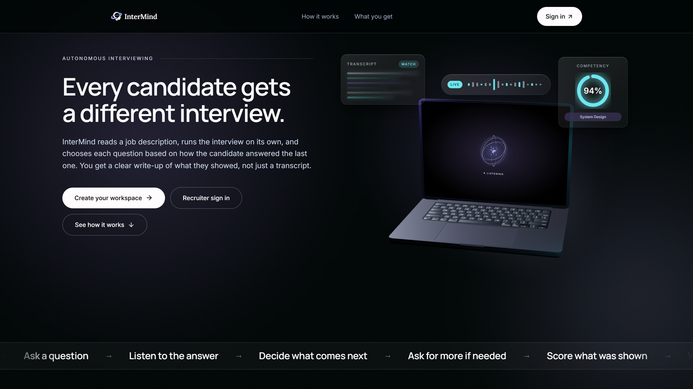
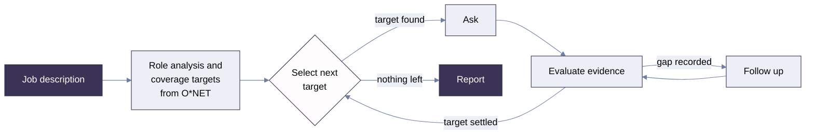
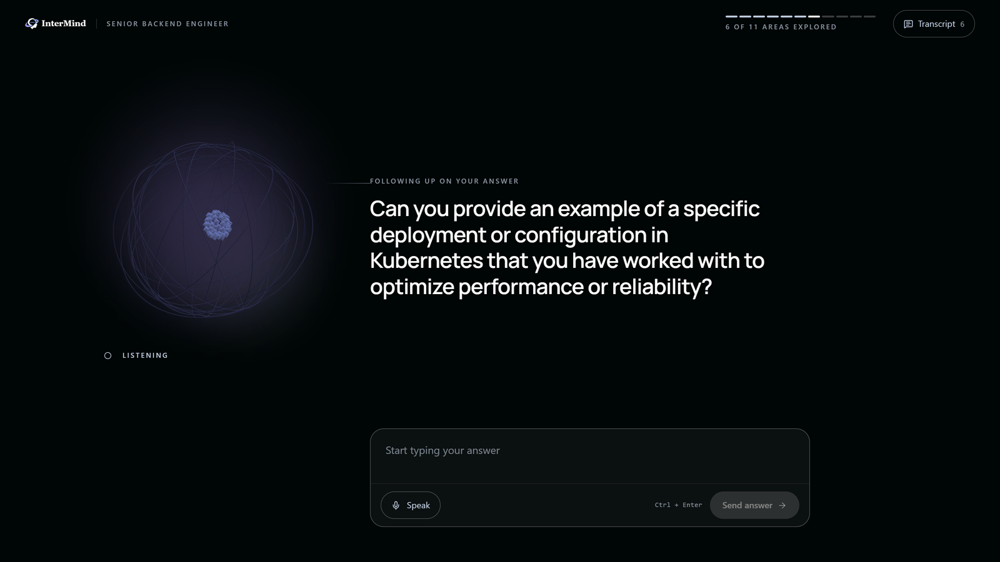
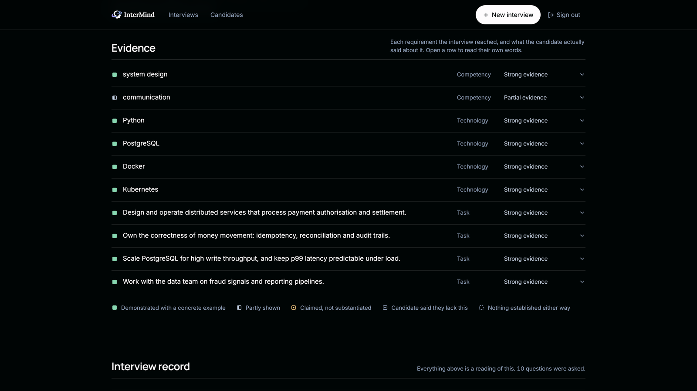
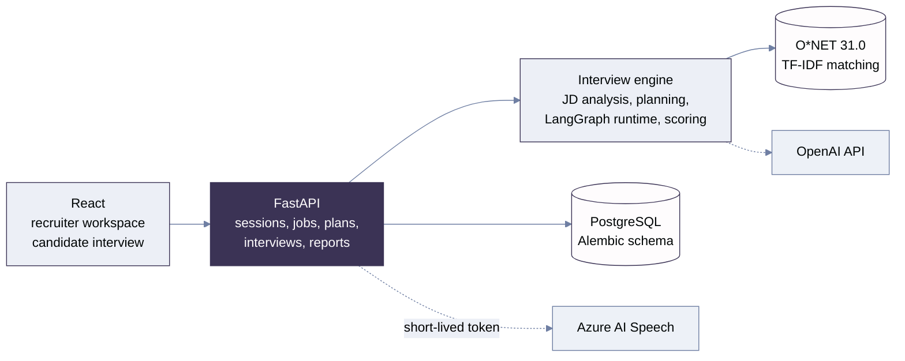

<div align="center">

<picture>
  <source media="(prefers-color-scheme: dark)" srcset="docs/assets/intermind-wordmark-dark.png">
  <source media="(prefers-color-scheme: light)" srcset="docs/assets/intermind-wordmark-light.png">
  
</picture>

### Autonomous AI Technical Interviewer

Adaptive interviews. Evidence-based hiring insight.

<p>
  
  
  
  
  
</p>

</div>



## What InterMind is

Most interview tooling generates a list of questions and then plays it back in order. InterMind does
not have a list.

It reads a job description into a structured role specification, grounds that role in occupational
data from O\*NET, and derives **coverage targets**: the competencies, technologies and tasks worth
assessing for it. The interview then runs as a stateful loop. Each time a question is needed,
InterMind chooses the next target from what has already been established, phrases a question for it
in the moment, evaluates the answer into structured evidence, and decides whether that settled the
target or needs one more push.

How many questions a candidate answers is an outcome of the conversation, not a property of the
plan, and every score in the report points back to something the candidate said.


An interview starts from a job description and nothing else. Step two is the recruiter reading back
what InterMind understood, before anything is built on top of it.

## Why it is different

- **Questions are generated during the interview, not before it.** The plan supplies targets; the
  phrasing happens at the moment of asking, with the interview's own history in context.
- **Target selection is deterministic and testable.** Which target comes next is a pure function of
  interview state and a category budget policy, not an LLM guess and not a static index.
- **Follow-ups are re-derived from structured evidence.** The evaluator returns an evidence type and
  a decision; the routing policy recomputes the call from that evidence rather than trusting the
  model's one-shot classification, which was observed under-calling follow-ups while simultaneously
  recording the gap.
- **Evidence volunteered about other targets is not lost.** Demonstrate Java while answering a Python
  question and the Java target resolves through a pure, LLM-free rule instead of being asked again.
- **Scores are deterministic; only the prose is generated.** Aggregation and the recommendation are
  pure functions of the recorded interview. The LLM writes the narrative and has no field through
  which it can change a number.
- **Multi-recruiter from the database up.** Recruiters register their own accounts, and ownership is
  enforced on every query rather than assumed.

## How the adaptive interview works



The loop is a LangGraph state machine compiled in `app/agents/interview_graph.py`, suspended on a
human-in-the-loop `interrupt` at every question so it waits for a real answer rather than simulating
one. Category budgets default to four competency questions, four technology questions and two task
questions, and each target may be followed up once.



The label above the question is the routing decision made visible: the candidate had just given a
broad answer about Kubernetes, so the graph followed up on that same target instead of moving on.
The counter tracks targets covered, not a fixed question list.

## Evidence-based evaluation

Each answer is evaluated into a score, an evidence type, strengths, weaknesses, supporting
quotations and any evidence about other targets. Scoring then aggregates those records
deterministically into competency assessments, an overall score and a recommendation. An LLM writes
the narrative around them, with a template fallback if generation fails.



Every row is a requirement the interview actually reached, and the legend is the distinction the
scoring is built on: a candidate saying they lack something is not the same as the interview never
establishing it, and neither is treated as a failed requirement.

## Architecture



Storage is chosen at startup: with `DATABASE_URL` set the SQL repositories are wired, and without it
the in-memory implementations are used and the application logs a warning. Alembic owns the schema
and the application never creates tables. Voice input is optional throughout and typing never
depends on any speech configuration: the Azure key stays server-side, and the browser receives only
a short-lived authorization token issued through the candidate access boundary.

**Access model.** Recruiters sign in to an opaque server-side session carried in an
`HttpOnly; SameSite=Strict` cookie, with passwords stored only as `scrypt` hashes; every
recruiter-scoped query takes its owner from the resolved session, never from the request.
Candidates hold a per-interview opaque token that satisfies only their own interview. Jobs, plans,
interviews and reports are owner-scoped, and another tenant's resource is reported exactly like an
unknown one. A candidate may read the plan for the job they are interviewing for and receives only
the role name and bare target list their screen needs. See
[docs/recruiter-auth.md](docs/recruiter-auth.md).

## Tech stack

| Layer | Technologies |
| :--- | :--- |
| Frontend | React 19.3, TypeScript 6.0, Vite 8.3, Tailwind CSS 4.3, React Router 7.18, Motion 13.4, Three.js 0.186 |
| Backend | FastAPI 0.141, Uvicorn 0.52, Pydantic 2.13 |
| AI and orchestration | LangGraph 1.2, OpenAI SDK 3.6, versioned Markdown prompts, structured Pydantic outputs |
| Knowledge | O\*NET 31.0 covering 1,016 occupations, scikit-learn 1.9 for TF-IDF and cosine similarity |
| Persistence | PostgreSQL via SQLAlchemy 2.0 async ORM, asyncpg 0.31, Alembic 1.20 |
| Speech | Azure AI Speech, Web Speech API for offline development |
| Quality | pytest 9.1, Vitest 5.0, Ruff 0.16, oxlint 1.82 |

Backend versions are those resolved in this checkout and `pyproject.toml` declares minimum bounds;
frontend versions are pinned in `frontend/package-lock.json`.

## Getting started

Python 3.11 or newer, and Node.js 22.12 or newer (the floor Vitest 5 requires). PostgreSQL is
optional locally.

```bash
git clone https://github.com/AliyahAlabdali/InterMind.git
cd InterMind

python -m venv .venv
source .venv/bin/activate      # Windows: .venv\Scripts\activate
pip install -e ".[dev]"

cd frontend && npm install && cd ..
```

```bash
cp .env.example .env                        # Windows: copy .env.example .env
cp frontend/.env.example frontend/.env      # Windows: copy frontend\.env.example frontend\.env
```

The defaults run entirely offline: `LLM_PROVIDER=fake` uses a deterministic in-process client and
`SPEECH_PROVIDER=browser` avoids any Azure dependency, so a fresh checkout starts with no
credentials. For real models set `LLM_PROVIDER=openai` and `OPENAI_API_KEY`. `.env` is git-ignored,
and nothing with a `VITE_` prefix may hold a secret, because that prefix compiles the value into the
public JavaScript bundle.

**The O\*NET knowledge base ships with the repository.** `data/processed/onet/onet_kb.jsonl` is
the one derived artifact that is tracked, because it is the only file the application reads and no
deployment can rebuild it — see `data/README.md`. To regenerate it, place the O\*NET 31.0 text
database under `data/raw/onet/db_31_0_text/` (git-ignored) and run
`notebooks/ONET_knowledge_base_pipeline.ipynb` end to end.

To run against PostgreSQL, set `DATABASE_URL` and apply the schema with `alembic upgrade head`.
Without it the application runs on in-memory repositories and warns at startup. Deployments set
`REQUIRE_DATABASE=true` so that warning becomes a refusal to start instead; `GET /health` reports
which storage is live.

Then two terminals. The API serves on `http://127.0.0.1:8000` with interactive documentation at
`/docs`, and the web application on `http://localhost:5173`, proxying `/api` to the backend so the
browser stays same-origin with its API.

```bash
uvicorn app.main:app --reload
```

```bash
cd frontend && npm run dev
```

## Verification

| Suite | Command | Result |
| :--- | :--- | :--- |
| Backend | `pytest -q` | 544 passed, across 40 files (25 unit, 15 integration) |
| Backend lint | `ruff check .` | all checks passed |
| Frontend | `npm run test` | 158 passed, across 19 files |
| Frontend types | `npm run typecheck` | clean |
| Frontend lint | `npm run lint` | 0 errors, 1 pre-existing warning |
| Frontend build | `npm run build` | succeeds |

Every test runs against the in-memory repositories and the deterministic fake LLM client, including
the API integration tests, which covers the domain models, services, interview graph, scoring,
access control and tenant isolation end to end through the real ASGI app. It does not exercise the
SQL repositories, the Alembic migration, a live OpenAI model or a live Azure Speech resource; the
speech token endpoint is tested against a mocked HTTP transport.

## Current limitations

- **Single backend process.** Recruiter sessions are held in memory, so two workers would sign
  recruiters out at random. Accounts and data are in PostgreSQL and unaffected. Scaling out needs a
  shared session store first.
- **In-flight interviews do not survive a restart.** LangGraph checkpoints to an in-memory saver, so
  a part-finished interview would have to be reissued. Completed interviews are unaffected: their
  reports are stored, and are served from persistence rather than from the graph.
- **The SQL persistence path has no automated test coverage.** It is verified by review and manual
  use.
- **No login rate limiting.** `scrypt` makes each attempt cost real CPU, which is a brake rather than
  brute-force protection.
- **No email verification, password reset, teams, roles or audit trail,** and one account per person.
- **Occupation matching is a TF-IDF baseline.** Adequate for common software roles, weaker on
  ambiguous ones.
- **Not deployed.** The repository holds the deployment architecture and configuration, not running
  infrastructure: there is no Dockerfile, no CI workflow and no provisioned environment. The intended
  topology is the frontend on Vercel with the backend and database on Azure.

## Documentation

- [docs/deployment.md](docs/deployment.md) for the step-by-step deployment guide, written against the
  architecture as built.
- [docs/recruiter-auth.md](docs/recruiter-auth.md) for the authentication, session and CSRF model.

## Author

Built by **Aliyah Alabdali**.

[GitHub](https://github.com/AliyahAlabdali) · [LinkedIn](https://www.linkedin.com/in/aliyah-alabdali-5ba599274/) · [Portfolio](https://aliyahalabdali.github.io)

<sub>O\*NET data is published by the U.S. Department of Labor and is redistributed here under
their terms of use; `data/processed/onet/onet_kb.jsonl` is derived from O\*NET 31.0. The hero laptop model is by <a href="https://sketchfab.com/3d-models/realistic-3d-laptop-model-high-quality-design-920fe8eceaf748a5b9ddd53385519322">Taohid Animation</a>, used under CC BY 4.0.</sub>
