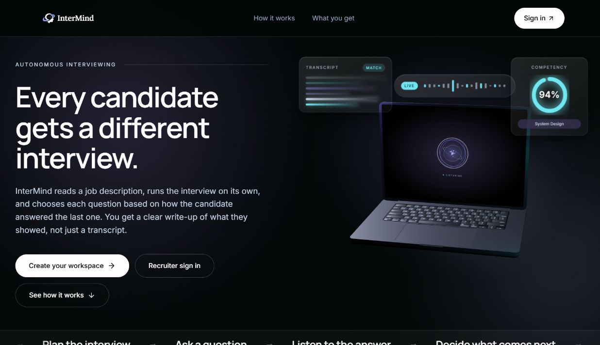
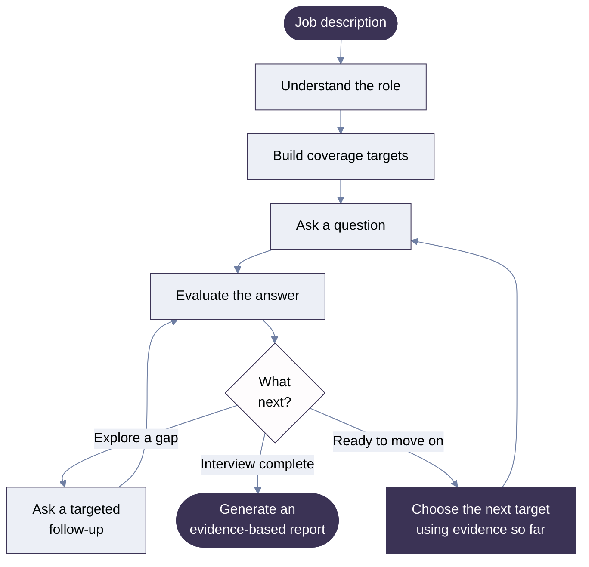
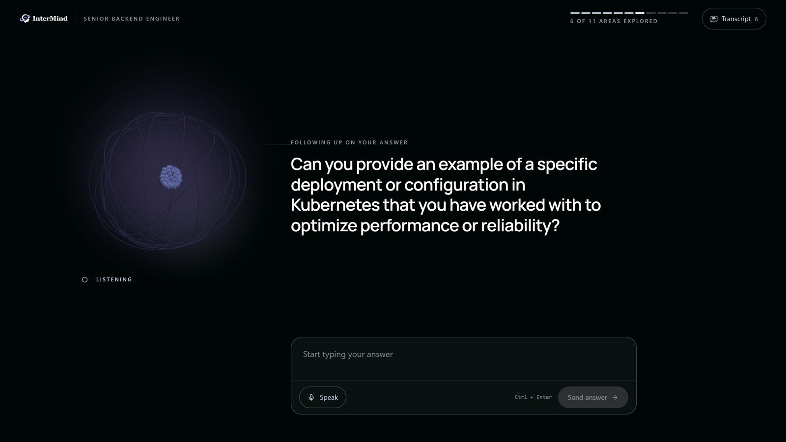
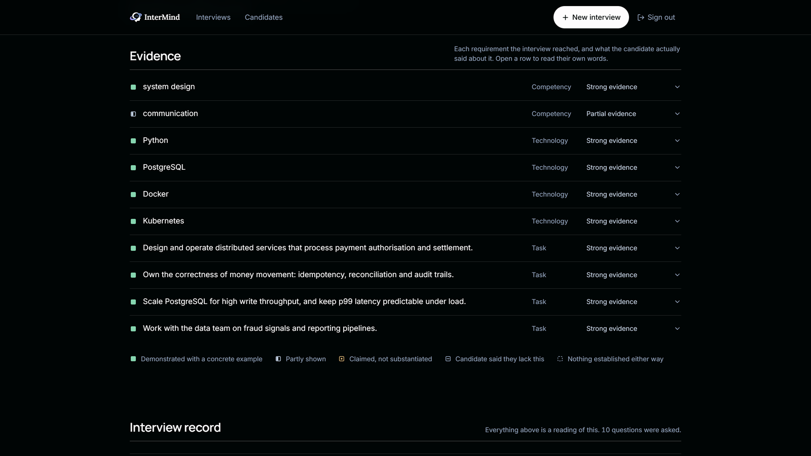
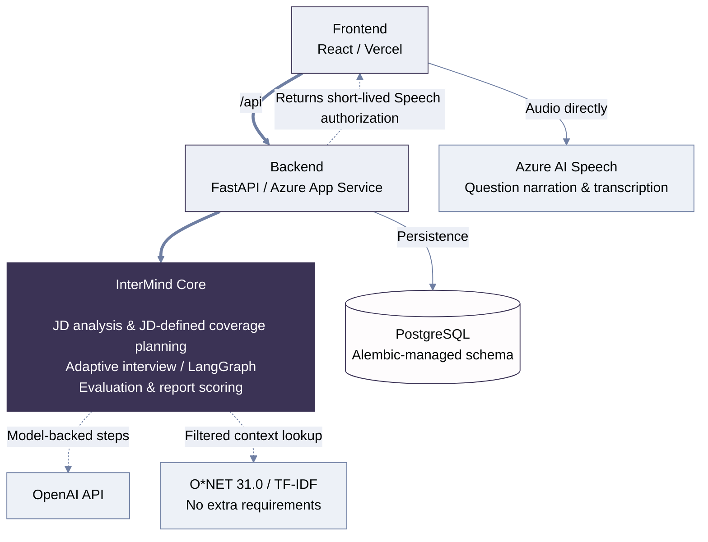

<div align="center">

<picture>
  <source media="(prefers-color-scheme: dark)" srcset="docs/assets/intermind-wordmark-dark.png">
  <source media="(prefers-color-scheme: light)" srcset="docs/assets/intermind-wordmark-light.png">
  
</picture>

### Autonomous AI Technical Interviewer

Adaptive interviews. Evidence-based hiring insight.

**[Live Demo → intermind-ai.vercel.app](https://intermind-ai.vercel.app)**

<p>
  
  
  
  
  
</p>

</div>



## What InterMind is

InterMind turns a job description into an adaptive technical interview and an evidence-based
report. The job description defines **coverage targets**: competencies, technologies and tasks to
assess. Filtered occupational context from O\*NET helps inform the interview without adding extra
requirements.

The targets exist before the conversation; question wording, target order and follow-up behavior
adapt at runtime. After each answer, InterMind records structured evidence and decides whether to
explore a gap or move to another target. Recruiters can trace the resulting assessments back to
what the candidate said.

The application is deployed with a **Vercel frontend, Azure App Service backend and PostgreSQL
persistence**.

<details>
<summary>Production landing page on mobile</summary>

<p align="center">
  
</p>

</details>


An interview starts from a job description and nothing else. Step two is the recruiter reading back
what InterMind understood, before anything is built on top of it.

## Features

- **Recruiter accounts and isolated workspaces.** Sign up, sign in and manage owned jobs,
  interviews and reports through session-based access control.
- **JD analysis and review.** Inspect the extracted role, seniority and requirements before
  building an interview coverage plan.
- **Candidate invitations and sessions.** Share a per-interview access link; candidates enter a
  guided interview, answer questions and see their coverage progress.
- **Runtime question generation.** Questions use the role, current target and conversation history.
  A deterministic selection policy chooses targets from the current coverage state.
- **Targeted follow-ups and cross-target evidence.** Routing rules use structured evaluations to
  decide when to probe further. Model-extracted evidence about another target can resolve it under
  deterministic rules, avoiding a redundant question.
- **Spoken interview.** Azure AI Speech reads each question aloud in one pinned adult voice and
  transcribes spoken answers. Typing and on-screen question text remain available throughout, so
  the interview is fully usable when speech is disabled or unavailable.
- **Evidence-based reports.** Per-answer evaluations feed deterministic report aggregation, with
  supporting evidence, requirement assessments and a generated narrative.
- **Persistent application records.** PostgreSQL stores recruiter accounts, jobs, plans, candidate
  and interview records, generated reports and activity entries. In-memory repositories support
  credential-free local development; live interview graph state remains in memory.

## How the adaptive interview works


```mermaid
%%{init: {"theme":"base","flowchart":{"rankSpacing":28,"nodeSpacing":36},"themeVariables":{"primaryColor":"#ECEFF6","primaryTextColor":"#000505","primaryBorderColor":"#3B3355","lineColor":"#6F7FA3","edgeLabelBackground":"#ECEFF6","tertiaryTextColor":"#000505","tertiaryColor":"#F6F8FB"}}}%%
flowchart TD
    JD(["Job description"]) --> ROLE["Understand the role"]
    ROLE --> PLAN["Build coverage targets"]
    PLAN --> ASK["Ask a question"]
    ASK --> EVAL["Evaluate the answer"]
    EVAL --> DECIDE{"What<br/>next?"}
    DECIDE -->|"Explore a gap"| FU["Ask a targeted<br/>follow-up"]
    FU --> EVAL
    DECIDE -->|"Interview complete"| REP(["Generate an<br/>evidence-based report"])
    DECIDE -->|"Ready to move on"| NEXT["Choose the next target<br/>using evidence so far"]
    NEXT --> ASK

    linkStyle default stroke:#6F7FA3,color:black;
    classDef accent fill:#3B3355,stroke:#3B3355,stroke-width:1px,color:#FEFCFD;
    classDef step fill:#ECEFF6,stroke:#3B3355,stroke-width:1px,color:#000505;
    classDef gate fill:#FEFCFD,stroke:#3B3355,stroke-width:1px,color:#000505;
    class JD,REP,NEXT accent;
    class ROLE,PLAN,ASK,EVAL,FU step;
    class DECIDE gate;
```

The loop is a LangGraph state machine compiled in `backend/app/agents/interview_graph.py`,
suspended on a human-in-the-loop `interrupt` at each question to wait for the candidate's answer.
Selection applies coverage priorities and budget rules; each target allows at most one follow-up.



The follow-up label makes the routing decision visible. The counter tracks coverage targets rather
than a fixed sequence of questions.

## Evidence-based evaluation

The evaluation model produces each answer's score, evidence type, strengths, weaknesses, supporting
evidence and evidence about other targets. Recorded evaluations are then **aggregated
deterministically** into requirement assessments, an overall score and a recommendation. The report
model writes the narrative around those results, with a template fallback on model-generation
failure; its output cannot alter the calculated scores or recommendation.



**Unassessed requirements are excluded from aggregation.** An explicit statement that the candidate
lacks experience is different: it is recorded evidence and may receive a low score that affects
the result. The report distinguishes demonstrated ability, partial evidence, claims, explicit lack
and requirements for which nothing was established.

## Architecture


```mermaid
%%{init: {"theme":"base","flowchart":{"rankSpacing":36,"nodeSpacing":36,"wrappingWidth":300},"themeVariables":{"primaryColor":"#ECEFF6","primaryTextColor":"#000505","primaryBorderColor":"#3B3355","lineColor":"#6F7FA3","edgeLabelBackground":"#ECEFF6","tertiaryTextColor":"#000505","tertiaryColor":"#F6F8FB"}}}%%
flowchart TD
    WEB["Frontend<br/>React / Vercel"] ==>|"/api"| API["Backend<br/>FastAPI / Azure App Service"]
    API ==> CORE["InterMind Core<br/><br/>JD analysis & JD-defined coverage planning<br/>Adaptive interview / LangGraph<br/>Evaluation & report scoring"]
    API -->|"Persistence"| DB[("PostgreSQL<br/>Alembic-managed schema")]
    CORE -.->|"Model-backed steps"| OAI["OpenAI API"]
    CORE -.->|"Filtered context lookup"| KB["O#42;NET 31.0 / TF-IDF<br/>No extra requirements"]
    API -.->|"Returns short-lived Speech authorization"| WEB
    WEB -->|"Audio directly"| AZ["Azure AI Speech<br/>Question narration & transcription"]

    linkStyle default stroke:#6F7FA3,color:black;
    classDef accent fill:#3B3355,stroke:#3B3355,stroke-width:1px,color:#FEFCFD;
    classDef step fill:#ECEFF6,stroke:#3B3355,stroke-width:1px,color:#000505;
    classDef store fill:#FEFCFD,stroke:#3B3355,stroke-width:1px,color:#000505;
    classDef ext fill:#EDF1F7,stroke:#6F7FA3,stroke-width:1px,color:#000505;
    class CORE accent;
    class WEB,API step;
    class DB store;
    class KB,OAI,AZ ext;
```

Storage is chosen at startup: with `DATABASE_URL` set the SQL repositories are wired, and without it
the in-memory implementations are used and the application logs a warning. Alembic owns the schema
and the application never creates tables. Production routes `/api` through Vercel to the backend;
the SPA fallback supports frontend routes. `GET /health` (`/api/health` through the frontend) reports
liveness and the storage mode selected at startup. **It does not test live database connectivity.**

**Access model.** Recruiters sign in to an opaque server-side session carried in an
`HttpOnly; SameSite=Strict` cookie, with passwords stored as `scrypt` hashes. Accounts are unique by
normalized email address. Recruiter workspace access is isolated by ownership; a reduced public job
endpoint is intentionally available without recruiter authentication. Candidates use an opaque
per-interview token and receive only the plan fields needed for their interview. See
[docs/recruiter-auth.md](docs/recruiter-auth.md).

**Azure Speech.** Speech is optional, and covers both directions: reading questions aloud and
transcribing spoken answers. Set backend `SPEECH_PROVIDER=azure` and frontend
`VITE_SPEECH_PROVIDER=azure` together. Production uses managed identity / Entra authorization
(`AZURE_SPEECH_AUTH=managed_identity`), with the Speech resource identifier and custom-domain host
configured on the backend. The browser obtains a short-lived authorization token through the
interview-scoped backend endpoint and uses it for both directions; audio goes directly to Azure
Speech, and the resource key never reaches the browser. Question narration uses one pinned adult
voice so every candidate hears the same interviewer, with browser speech synthesis as a fallback
if narration fails. Local key-based authorization is also supported with `AZURE_SPEECH_AUTH=key`,
`AZURE_SPEECH_KEY` and `AZURE_SPEECH_REGION` set only on the backend. Typed input and on-screen
question text remain available throughout.

## Tech stack

| Layer | Technologies |
| :--- | :--- |
| Frontend | React 19.3, TypeScript 6.0, Vite 8.3, Tailwind CSS 4.3, React Router 7.18, Motion 13.4, Three.js 0.186 |
| Backend | FastAPI 0.141, Uvicorn 0.52, Pydantic 2.13 |
| AI and orchestration | LangGraph 1.2, OpenAI SDK 3.6, versioned Markdown prompts, structured Pydantic outputs |
| Knowledge | O\*NET 31.0 covering 1,016 occupations, scikit-learn 1.9 for TF-IDF and cosine similarity |
| Persistence | PostgreSQL via SQLAlchemy 2.0 async ORM, asyncpg 0.31, Alembic 1.20 |
| Speech | Azure AI Speech for question narration and transcription; browser Web Speech API as fallback; typed input |
| Quality | pytest 9.1, Vitest 5.0, Ruff 0.16, oxlint 1.82 |

Backend deployment versions are pinned in `backend/requirements.txt`; `backend/pyproject.toml`
declares minimum bounds. Frontend resolved versions are recorded in `frontend/package-lock.json`.

## Getting started

Use **Python 3.11+** and a Node.js version matching **`^22.12.0 || ^24.0.0 || >=26.0.0`**, the
range required by the locked Vitest version and compatible with the frontend toolchain. PostgreSQL
is optional locally. The commands below use a POSIX shell; PowerShell equivalents are noted.

Clone the repository, then install the backend from **`backend/`**. The virtual environment
lives at the repository root; only the install itself runs from `backend/`, where
`pyproject.toml` is:

```bash
git clone https://github.com/AliyahAlabdali/InterMind.git
cd InterMind

python -m venv .venv
source .venv/bin/activate      # PowerShell: .\.venv\Scripts\Activate.ps1

cd backend
pip install -e ".[dev]"
```

```bash
cp .env.example .env          # PowerShell: Copy-Item .env.example .env
```

Install the frontend and copy its configuration from **`frontend/`**:

```bash
cd ../frontend
npm ci
cp .env.example .env          # PowerShell: Copy-Item .env.example .env
```

`LLM_PROVIDER=fake` enables **credential-free local development** with an in-process model
substitute. The example Speech settings use `browser`; browser recognition support varies and may
require network access. For typed-only development, set backend `SPEECH_PROVIDER=disabled` and
frontend `VITE_SPEECH_PROVIDER=disabled`. This is not a guarantee that the whole application runs
offline.

For real model calls, set backend `LLM_PROVIDER=openai` and `OPENAI_API_KEY`. `.env` files are
git-ignored. Never put a secret in a `VITE_` variable: those values enter the public browser bundle.

**The O\*NET knowledge base ships with the repository.**
`backend/data/processed/onet/onet_kb.jsonl` is the tracked artifact consumed by the application;
deployments use it without rebuilding it. See [backend/data/README.md](backend/data/README.md).
To regenerate it, place the O\*NET 31.0 text database under
`backend/data/raw/onet/db_31_0_text/` (git-ignored) and run
`notebooks/ONET_knowledge_base_pipeline.ipynb` end to end.

For PostgreSQL, set backend `DATABASE_URL`, then run `alembic upgrade head` from **`backend/`**,
with the Python environment active. Without a database URL, local development uses
in-memory repositories and logs a warning. Set `REQUIRE_DATABASE=true` in deployments to refuse
startup when the URL is missing; this does not replace a database connectivity check.

Then two terminals. The API serves on `http://127.0.0.1:8000` with interactive documentation at
`/docs`, and the web application on `http://localhost:5173`, proxying `/api` to the backend so the
browser stays same-origin with its API.

| Terminal | Working directory | Command |
| :--- | :--- | :--- |
| Backend, Python environment active | `backend/` | `uvicorn app.main:app --reload` |
| Frontend | `frontend/` | `npm run dev` |

## Verification

Run the checks from their indicated directories; test totals are intentionally not pinned here.

| Check | Working directory | Command |
| :--- | :--- | :--- |
| Backend tests | `backend/` | `pytest -q` |
| Backend lint | `backend/` | `ruff check .` |
| Frontend tests | `frontend/` | `npm test` |
| Frontend types | `frontend/` | `npm run typecheck` |
| Frontend lint | `frontend/` | `npm run lint` |
| Frontend build | `frontend/` | `npm run build` |

Backend API tests use in-memory repositories and a fake LLM. Coverage includes the interview graph,
scoring, access control and tenant isolation. Frontend tests cover UI flows, Speech integration
behavior and legal-route scrolling. These suites do not establish live PostgreSQL, model-provider
or Azure Speech availability; provider interactions are mocked.

## Current limitations

InterMind currently focuses on the core autonomous interview workflow. A few areas could be strengthened further:

- **Session recovery:** Active interview progress and recruiter sessions are kept in memory. If the backend restarts, users may need to sign in again and an active interview would need to be restarted.
- **Report saving:** Generated reports are stored in PostgreSQL and remain available after restarts. Reports are currently created when interview results are first accessed, rather than immediately when the interview ends.
- **Account features:** Recruiters have separate, protected workspaces. Features such as password recovery, email verification, shared team workspaces, and login rate limiting are not currently included.
- **Database testing:** The automated test suite covers the application extensively, but PostgreSQL repositories and migrations are not yet tested against a live PostgreSQL instance.

## Documentation

- [docs/deployment.md](docs/deployment.md) for deployment setup background. The deployed topology is
  summarized above; use the current configuration files and environment examples alongside it.
- [docs/recruiter-auth.md](docs/recruiter-auth.md) for the authentication, session and CSRF model.

## Author

Built by **Aliyah Alabdali**.

<p>
  <a href="https://github.com/AliyahAlabdali" title="Aliyah Alabdali on GitHub"></a>
  &nbsp;&nbsp;
  <a href="https://www.linkedin.com/in/aliyah-alabdali-5ba599274/" title="Aliyah Alabdali on LinkedIn"></a>
  &nbsp;&nbsp;
  <a href="https://aliyahalabdali.github.io" title="Aliyah Alabdali's Portfolio"></a>
  &nbsp;&nbsp;
  <a href="mailto:AliyahAlabdali24@gmail.com" title="Email Aliyah Alabdali"></a>
</p>

<sub>O\*NET data is published by the U.S. Department of Labor and is redistributed here under
their terms of use; `backend/data/processed/onet/onet_kb.jsonl` is derived from O\*NET 31.0. The hero laptop model is by <a href="https://sketchfab.com/3d-models/realistic-3d-laptop-model-high-quality-design-920fe8eceaf748a5b9ddd53385519322">Taohid Animation</a>, used under CC BY 4.0.</sub>
