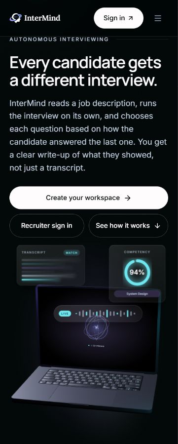
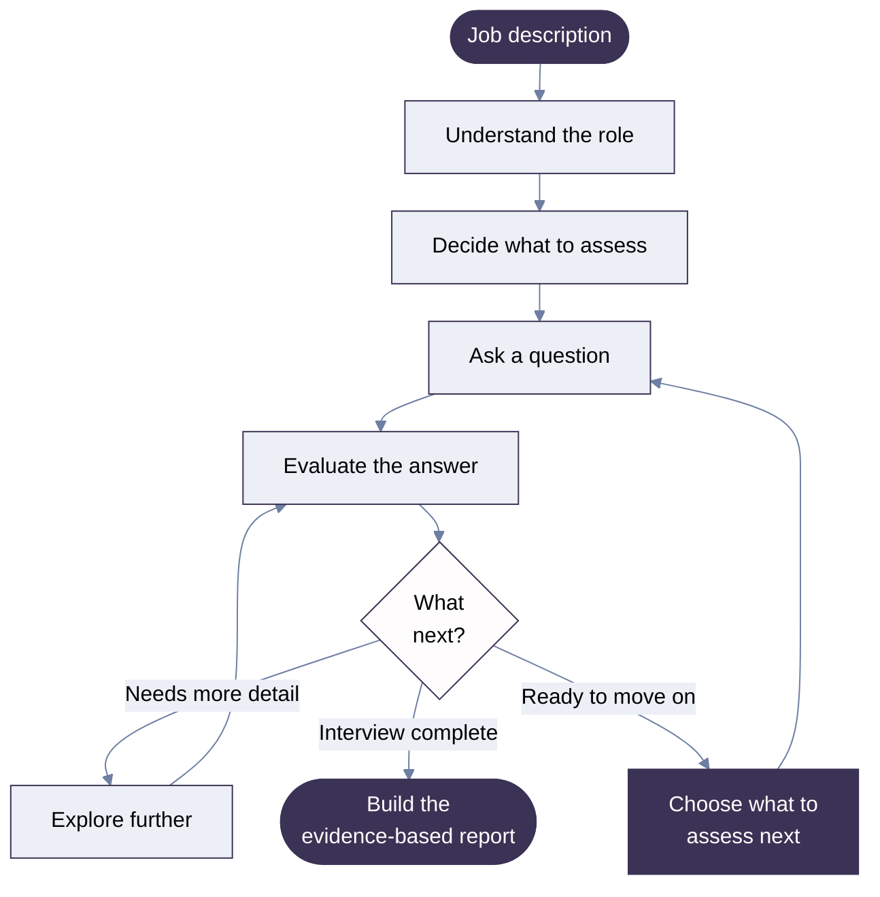
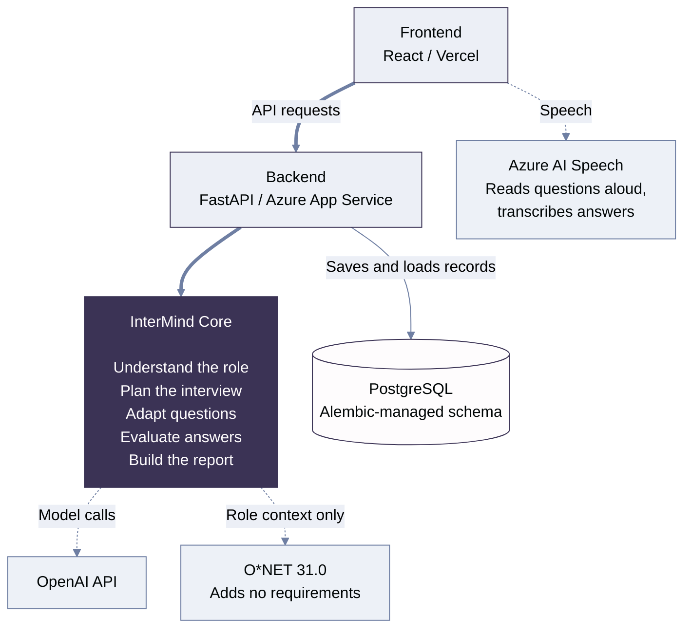

<div align="center">

<picture>
  <source media="(prefers-color-scheme: dark)" srcset="docs/assets/intermind-wordmark-dark.png">
  <source media="(prefers-color-scheme: light)" srcset="docs/assets/intermind-wordmark-light.png">
  
</picture>

### Autonomous AI Technical Interviewer

Adaptive interviews. Evidence-based hiring insight.

**[Live Demo → intermind-ai.vercel.app](https://intermind-ai.vercel.app)**

<p>
  
  
  
  
  
</p>

</div>


## What InterMind is

InterMind turns a job description into an adaptive technical interview and an evidence-based
report. It reads the job description to decide **what the interview should assess**: the
competencies, technologies and tasks the role needs. Filtered occupational context from O\*NET
helps inform the interview without adding extra requirements.

Those assessment areas are set before the conversation starts; question wording, their order and
follow-up behavior adapt at runtime. After each answer, InterMind records structured evidence and
decides whether to explore further or move to another area. Recruiters can trace every assessment
back to what the candidate said.

The application is deployed with a **Vercel frontend, Azure App Service backend and PostgreSQL
persistence**.

<details>
<summary>Production landing page on mobile</summary>

<p align="center">
  
</p>

</details>

Every interview starts with a job description. Before building the interview, the recruiter reviews
what InterMind understood from it.


## Features

- **Job-aware interview planning.** Extracts the role, requirements and assessment areas from a job description for recruiter review.
- **Adaptive interviewing.** Generates questions at runtime and decides whether to follow up or move on based on recorded evidence.
- **Candidate sessions.** Provides shareable interview links with isolated candidate access and persistent progress.
- **Speech support.** Azure AI Speech narrates questions and transcribes answers, with typed input always available.
- **Evidence-based reports.** Turns recorded evaluations into requirement assessments, scores and a recruiter-facing report.


## How the adaptive interview works


```mermaid
%%{init: {"theme":"base","flowchart":{"rankSpacing":28,"nodeSpacing":36},"themeVariables":{"primaryColor":"#ECEFF6","primaryTextColor":"#000505","primaryBorderColor":"#3B3355","lineColor":"#6F7FA3","edgeLabelBackground":"#ECEFF6","tertiaryTextColor":"#000505","tertiaryColor":"#F6F8FB"}}}%%
flowchart TD
    JD(["Job description"]) --> ROLE["Understand the role"]
    ROLE --> PLAN["Decide what to assess"]
    PLAN --> ASK["Ask a question"]
    ASK --> EVAL["Evaluate the answer"]
    EVAL --> DECIDE{"What<br/>next?"}
    DECIDE -->|"Needs more detail"| FU["Explore further"]
    FU --> EVAL
    DECIDE -->|"Interview complete"| REP(["Build the<br/>evidence-based report"])
    DECIDE -->|"Ready to move on"| NEXT["Choose what to<br/>assess next"]
    NEXT --> ASK

    linkStyle default stroke:#6F7FA3,color:black;
    classDef accent fill:#3B3355,stroke:#3B3355,stroke-width:1px,color:#FEFCFD;
    classDef step fill:#ECEFF6,stroke:#3B3355,stroke-width:1px,color:#000505;
    classDef gate fill:#FEFCFD,stroke:#3B3355,stroke-width:1px,color:#000505;
    class JD,REP,NEXT accent;
    class ROLE,PLAN,ASK,EVAL,FU step;
    class DECIDE gate;
```

The loop is a LangGraph state machine compiled in `backend/app/agents/interview_graph.py`,
suspended on a human-in-the-loop `interrupt` at each question to wait for the candidate's answer.
Selection uses assessment priorities and budget rules; each area allows at most one follow-up.


The follow-up label makes the routing decision visible. The counter tracks assessment areas rather
than a fixed sequence of questions.

## Evidence-based evaluation

Each answer produces structured evidence, strengths, weaknesses and a score. InterMind aggregates these evaluations into requirement assessments and an overall result, then builds the report narrative around them.


Unassessed requirements do not affect the score. Explicit evidence that a candidate lacks a requirement can.

## Architecture


```mermaid
%%{init: {"theme":"base","flowchart":{"rankSpacing":36,"nodeSpacing":36,"wrappingWidth":300},"themeVariables":{"primaryColor":"#ECEFF6","primaryTextColor":"#000505","primaryBorderColor":"#3B3355","lineColor":"#6F7FA3","edgeLabelBackground":"#ECEFF6","tertiaryTextColor":"#000505","tertiaryColor":"#F6F8FB"}}}%%
flowchart TD
    WEB["Frontend<br/>React / Vercel"]
    WEB ==>|"API requests"| API["Backend<br/>FastAPI / Azure App Service"]
    WEB -.->|"Speech"| AZ["Azure AI Speech<br/>Reads questions aloud,<br/>transcribes answers"]
    API ==> CORE["InterMind Core<br/><br/>Understand the role<br/>Plan the interview<br/>Adapt questions<br/>Evaluate answers<br/>Build the report"]
    API -->|"Saves and loads records"| DB[("PostgreSQL<br/>Alembic-managed schema")]
    CORE -.->|"Model calls"| OAI["OpenAI API"]
    CORE -.->|"Role context only"| KB["O*NET 31.0<br/>Adds no requirements"]

    linkStyle default stroke:#6F7FA3,color:black;
    classDef accent fill:#3B3355,stroke:#3B3355,stroke-width:1px,color:#FEFCFD;
    classDef step fill:#ECEFF6,stroke:#3B3355,stroke-width:1px,color:#000505;
    classDef store fill:#FEFCFD,stroke:#3B3355,stroke-width:1px,color:#000505;
    classDef ext fill:#EDF1F7,stroke:#6F7FA3,stroke-width:1px,color:#000505;
    class CORE accent;
    class WEB,API step;
    class DB store;
    class KB,OAI,AZ ext;
```

Production uses PostgreSQL with an Alembic-managed schema, while local development can use in-memory storage. Vercel serves the frontend and routes `/api` requests to the FastAPI backend on Azure App Service.

**Access and Speech.** Recruiter workspaces are isolated by account ownership, while candidates use an interview-specific access token. Azure AI Speech handles question narration and answer transcription through short-lived authorization issued by the backend. Typed input remains available when Speech is unavailable. See [recruiter authentication](docs/recruiter-auth.md) and [public launch security](docs/public-launch-security.md) for implementation details.

## Tech stack

| Layer | Technologies |
| :--- | :--- |
| Frontend | React 19.3, TypeScript 6.0, Vite 8.3, Tailwind CSS 4.3, React Router 7.18, Motion 13.4, Three.js 0.186 |
| Backend | FastAPI 0.141, Uvicorn 0.52, Pydantic 2.13 |
| AI and orchestration | LangGraph 1.2, OpenAI SDK 3.6, versioned Markdown prompts, structured Pydantic outputs |
| Knowledge | O\*NET 31.0 covering 1,016 occupations, scikit-learn 1.9 for TF-IDF and cosine similarity |
| Persistence | PostgreSQL via SQLAlchemy 2.0 async ORM, asyncpg 0.31, Alembic 1.20 |
| Speech | Azure AI Speech for question narration and transcription; browser Web Speech API as fallback; typed input |
| Quality | pytest 9.1, Vitest 5.0, Ruff 0.16, oxlint 1.82 |

Backend deployment versions are pinned in `backend/requirements.txt`; `backend/pyproject.toml`
declares minimum bounds. Frontend resolved versions are recorded in `frontend/package-lock.json`.

## Getting started

Requires **Python 3.11+** and Node.js **`^22.12.0 || ^24.0.0 || >=26.0.0`**. PostgreSQL is optional for local development.

Clone the repository and install the backend:

```bash
git clone https://github.com/AliyahAlabdali/InterMind.git
cd InterMind

python -m venv .venv
source .venv/bin/activate      # PowerShell: .\.venv\Scripts\Activate.ps1

cd backend
pip install -e ".[dev]"
cp .env.example .env          # PowerShell: Copy-Item .env.example .env
```

Install the frontend:

```bash
cd ../frontend
npm ci
cp .env.example .env          # PowerShell: Copy-Item .env.example .env
```

`LLM_PROVIDER=fake` supports credential-free local development. For real model calls, set `LLM_PROVIDER=openai` and `OPENAI_API_KEY`. Never place secrets in `VITE_` variables.

The O\*NET knowledge base is already included in the repository. See [backend/data/README.md](backend/data/README.md) for its source and regeneration process.

For PostgreSQL, set `DATABASE_URL` and run `alembic upgrade head` from `backend/`. Without it, local development uses in-memory storage.

Start the application in two terminals:

| Terminal | Working directory | Command |
| :--- | :--- | :--- |
| Backend | `backend/` | `uvicorn app.main:app --reload` |
| Frontend | `frontend/` | `npm run dev` |

The API runs at `http://127.0.0.1:8000` and the frontend at `http://localhost:5173`.

## Verification

| Check | Working directory | Command |
| :--- | :--- | :--- |
| Backend tests | `backend/` | `pytest -q` |
| Backend lint | `backend/` | `ruff check .` |
| Frontend tests | `frontend/` | `npm test` |
| Frontend types | `frontend/` | `npm run typecheck` |
| Frontend lint | `frontend/` | `npm run lint` |
| Frontend build | `frontend/` | `npm run build` |

Tests cover the interview flow, scoring, access control, tenant isolation, UI flows and Speech integration behavior. External provider interactions are mocked and do not verify live service availability.

## Current limitations

- Recruiter sessions are currently stored in memory, so a backend restart requires recruiters to sign in again.
- Reports are generated when results are first accessed rather than immediately when an interview ends.
- Password recovery, email verification and shared team workspaces are not currently included.
- Speech authorization limits credential issuance, but cannot cap Azure audio consumption after a credential has been issued.

See [public launch security](docs/public-launch-security.md) and [deployment notes](docs/deployment.md) for operational details.

## Documentation

- [Deployment](docs/deployment.md)
- [Recruiter authentication](docs/recruiter-auth.md)
- [Public launch security](docs/public-launch-security.md)

## Author

Built by **Aliyah Alabdali**.

<p>
  <a href="https://github.com/AliyahAlabdali" title="Aliyah Alabdali on GitHub"></a>
  &nbsp;&nbsp;
  <a href="https://www.linkedin.com/in/aliyah-alabdali-5ba599274/" title="Aliyah Alabdali on LinkedIn"></a>
  &nbsp;&nbsp;
  <a href="https://aliyahalabdali.github.io" title="Aliyah Alabdali's Portfolio"></a>
  &nbsp;&nbsp;
  <a href="mailto:AliyahAlabdali24@gmail.com" title="Email Aliyah Alabdali"></a>
</p>

<sub>O\*NET data is published by the U.S. Department of Labor and is redistributed here under
their terms of use; `backend/data/processed/onet/onet_kb.jsonl` is derived from O\*NET 31.0. The hero laptop model is by <a href="https://sketchfab.com/3d-models/realistic-3d-laptop-model-high-quality-design-920fe8eceaf748a5b9ddd53385519322">Taohid Animation</a>, used under CC BY 4.0.</sub>
